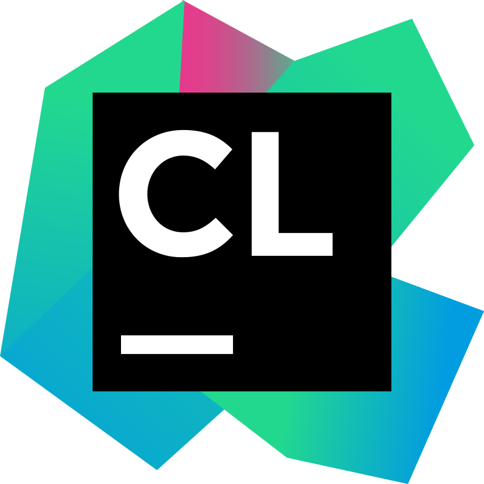

# 
Shawky Ebrahim Ahmed

I am a second-year computer science student at Cairo University. I am passionate about programming and solving problems using technology. I have experience working with CPP, Java, Python, MySQL, Node.js, and Express.js.

Download [my resume]('https://drive.google.com/drive/folders/1yJmOWWaRQpM32haB8CeXCOzK0_WC6o59?usp=share_link')

## Education

Cairo University, Bachelor of Science in Computer Science (expected graduation: 2025)

## Programming languages

&nbsp;&nbsp;
&nbsp;&nbsp;
&nbsp;&nbsp;

&nbsp;&nbsp;
&nbsp;&nbsp;

&nbsp;&nbsp;
&nbsp;&nbsp;
&nbsp;&nbsp;

&nbsp;&nbsp;
&nbsp;&nbsp;

## Databases

&nbsp;&nbsp;
&nbsp;&nbsp;

## Tools

&nbsp;&nbsp;
&nbsp;&nbsp;
&nbsp;&nbsp;
&nbsp;&nbsp;

&nbsp;&nbsp;
&nbsp;&nbsp;
&nbsp;&nbsp;
&nbsp;&nbsp;

## Follow me on

&nbsp;&nbsp;

&nbsp;&nbsp;

&nbsp;&nbsp;

&nbsp;&nbsp;

&nbsp;&nbsp;

  &nbsp;&nbsp;

## 
Best Projects

  

  

  

